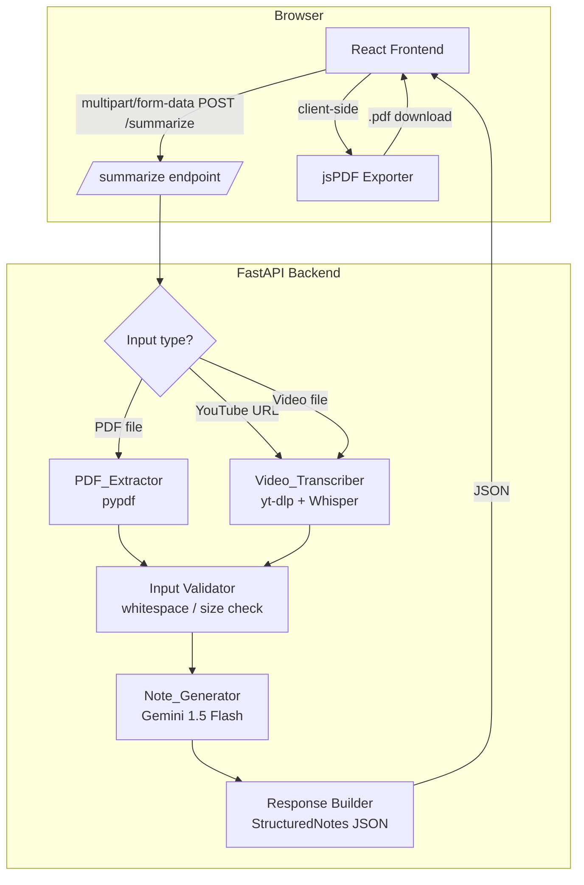

# Design Document: AI Powered Smart Summarizer

## Overview

The AI Powered Smart Summarizer is a full-stack web application with a React frontend and a Python FastAPI backend. Users upload PDF documents or submit YouTube URLs / video files; the backend extracts or transcribes the content, sends it to Google Gemini for structured note generation, and returns the result to the frontend for display and optional PDF export.

The existing `main.py` is a minimal proof-of-concept. This design replaces it with a production-quality architecture that satisfies all seven requirements: robust file validation, video transcription via yt-dlp + OpenAI Whisper, structured Gemini output with retry logic, client-side PDF export via jsPDF, and a fully accessible React UI.

### Key Design Decisions

| Decision | Choice | Rationale |
|---|---|---|
| Speech-to-text | `openai-whisper` (local, `base` model) | No per-call cost, runs offline, sufficient accuracy for lecture audio |
| Video download | `yt-dlp` + `ffmpeg` | Actively maintained, handles YouTube age-gating and format selection |
| PDF extraction | `pypdf` (already in project) | Already a dependency; handles password detection and page iteration |
| PDF export | `jsPDF` (client-side) | No server round-trip needed; keeps backend stateless |
| AI model | `gemini-1.5-flash` (already in project) | Fast, cost-effective, 1M token context window |
| Frontend framework | React + Vite | Standard choice; fast HMR for development |
| Styling | CSS custom properties (design tokens) | Satisfies Requirement 7.2 without adding a CSS-in-JS dependency |

---

## Architecture



### Request Flow

1. User selects a PDF or provides a video source and clicks Submit.
2. Frontend validates inputs client-side (size, format, URL pattern, mutual exclusion).
3. Frontend POSTs `multipart/form-data` to `POST /summarize`.
4. Backend validates file bytes (magic bytes, size, password protection).
5. Backend extracts text (PDF) or downloads + transcribes audio (video).
6. Backend validates extracted text is non-empty.
7. Backend truncates to 30,000 chars and calls Gemini with a structured prompt.
8. Backend validates the response contains required sections; retries once if not.
9. Backend returns `StructuredNotes` JSON.
10. Frontend renders notes in section cards and shows the Download button.
11. On download click, jsPDF generates the PDF entirely in the browser.

---

## Components and Interfaces

### Backend Components

#### `PDF_Extractor` (`app/extractors/pdf_extractor.py`)

```python
def extract_text(file_bytes: bytes) -> str:
    """
    Raises:
        InvalidFileError (HTTP 422) – MIME/magic bytes mismatch
        FileSizeError   (HTTP 413) – file > 20 MB
        PasswordError   (HTTP 422) – password-protected PDF
        NoTextError     (HTTP 422) – no readable text extracted
    Returns:
        Concatenated text from all pages.
    """
```

Validation order:
1. Check `len(file_bytes) > 20 * 1024 * 1024` → raise `FileSizeError`
2. Check `file_bytes[:4] != b'%PDF'` → raise `InvalidFileError`
3. Open with `pypdf.PdfReader`; catch `pypdf.errors.FileNotDecryptedError` → raise `PasswordError`
4. Iterate pages, accumulate `page.extract_text() or ""`
5. If accumulated text is blank → raise `NoTextError`

#### `Video_Transcriber` (`app/extractors/video_transcriber.py`)

```python
def transcribe_youtube(url: str) -> str:
    """Download audio via yt-dlp, transcribe with Whisper."""

def transcribe_file(file_bytes: bytes, filename: str) -> str:
    """Write bytes to temp file, transcribe with Whisper."""
```

YouTube flow:
1. Validate URL pattern with regex before calling yt-dlp.
2. Use `yt-dlp` with `--extract-audio --audio-format mp3 -o <tmpfile>` options via Python API (`yt_dlp.YoutubeDL`).
3. Catch `yt_dlp.utils.DownloadError` → raise `VideoAccessError` (HTTP 422, "video cannot be accessed").
4. Load Whisper `base` model, call `model.transcribe(audio_path)`.
5. If `result["text"].strip() == ""` → raise `NoSpeechError` (HTTP 422, "no speech detected").

Local file flow:
1. Write `file_bytes` to a `tempfile.NamedTemporaryFile`.
2. Same Whisper transcription steps 4–5 above.

#### `Note_Generator` (`app/generators/note_generator.py`)

```python
def generate_notes(text: str) -> StructuredNotes:
    """
    Truncates, prompts Gemini, validates, retries once.
    Raises:
        AIServiceError (HTTP 503) – timeout or API error
        IncompleteResponseError (HTTP 503) – missing sections after retry
    """
```

Truncation logic (pure function, easily testable):
```python
def truncate_text(text: str, max_chars: int = 30_000) -> str:
    if len(text) <= max_chars:
        return text
    half = max_chars // 2
    return text[:half] + text[-half:]
```

Prompt template:
```
You are an expert academic note-taker. Given the following content, produce structured notes in exactly this JSON format:
{
  "key_points": ["point1", "point2", ...],        // at least 3 items
  "bullet_summary": ["bullet1", "bullet2", ...],  // at least 3 items, each ≤ 25 words
  "chapters": [{"title": "...", "summary": "..."}] // omit key if fewer than 2 sections detected
}
Rules:
- key_points: minimum 3, each covering a distinct topic
- bullet_summary: minimum 3, each ≤ 25 words
- chapters: include only if the source has 2+ explicit headings, numbered chapters, or paragraph breaks of 3+ lines
- Do not contradict any named entity, number, or factual claim in the source

Content:
{text}
```

Gemini is called with `response_mime_type="application/json"` and a `response_schema` matching `StructuredNotes` to enforce structured output.

Timeout: `asyncio.wait_for(gemini_call(), timeout=30.0)` → `asyncio.TimeoutError` → `AIServiceError`.

Retry: if parsed response is missing `key_points` or `bullet_summary`, retry once. If second attempt also fails → `IncompleteResponseError`.

#### `PDF_Exporter` (server-side logging only)

PDF generation is handled client-side by jsPDF. The backend only logs failures if the frontend reports them via `POST /log-error`.

#### FastAPI Application (`app/main.py`)

```
POST /summarize
  Body: multipart/form-data
    - input_type: "pdf" | "youtube" | "video"
    - file: UploadFile (optional)
    - youtube_url: str (optional)
  Response 200: StructuredNotes JSON
  Response 400: { "detail": "extracted content is empty" }
  Response 413: { "detail": "...20 MB...file size limit..." }
  Response 422: { "detail": "..." }
  Response 503: { "detail": "AI service temporarily unavailable" | "incomplete AI response" }

POST /log-error
  Body: { "reason": str, "timestamp": str }
  Response 200: { "ok": true }
```

### Frontend Components

```
src/
  main.tsx                  – React entry point
  App.tsx                   – root layout, state orchestration
  design-tokens.css         – all CSS custom properties (colors, spacing, fonts)
  components/
    HeroSection.tsx         – app title and description
    InputSection.tsx        – PDF upload + YouTube URL + video upload controls
    ProgressIndicator.tsx   – animated stage label cycling
    ResultsSection.tsx      – three note cards + Download button
    ErrorPanel.tsx          – red/amber error display
    NoteCard.tsx            – individual section card (Key Points / Summary / Chapters)
  hooks/
    useSummarizer.ts        – fetch logic, state machine, retry on network error
  utils/
    validators.ts           – URL pattern check, file size/type checks
    pdfExporter.ts          – jsPDF generation logic
    truncate.ts             – mirrors backend truncation (for display purposes)
```

#### State Machine (`useSummarizer.ts`)

```
idle → submitting → extracting → transcribing (video only) → generating → success
                                                                         → error
     ← retry (on network error) ←────────────────────────────────────────┘
```

Progress label mapping:
- `extracting` → "Extracting content…"
- `transcribing` → "Transcribing audio…"
- `generating` → "Generating notes…"

---

## Data Models

### Backend (Pydantic)

```python
from pydantic import BaseModel
from typing import Optional

class ChapterItem(BaseModel):
    title: str
    summary: str

class StructuredNotes(BaseModel):
    key_points: list[str]        # len >= 3
    bullet_summary: list[str]    # len >= 3, each word count <= 25
    chapters: Optional[list[ChapterItem]] = None

class ErrorResponse(BaseModel):
    detail: str

class SummarizeRequest(BaseModel):
    input_type: str              # "pdf" | "youtube" | "video"
    youtube_url: Optional[str] = None
```

### Frontend (TypeScript)

```typescript
interface ChapterItem {
  title: string;
  summary: string;
}

interface StructuredNotes {
  key_points: string[];
  bullet_summary: string[];
  chapters?: ChapterItem[];
}

type SummarizerState =
  | { status: "idle" }
  | { status: "submitting" | "extracting" | "transcribing" | "generating" }
  | { status: "success"; notes: StructuredNotes }
  | { status: "error"; message: string; isNetwork: boolean };
```

### Validation Constants

```typescript
// validators.ts
export const PDF_MAX_BYTES = 20 * 1024 * 1024;       // 20 MB
export const VIDEO_MAX_BYTES = 100 * 1024 * 1024;    // 100 MB
export const YOUTUBE_PATTERN =
  /^https:\/\/(www\.youtube\.com\/watch\?v=|youtu\.be\/)[\w-]{11}/;
export const ACCEPTED_VIDEO_EXTS = [".mp4", ".webm"];
```

---

## Correctness Properties

*A property is a characteristic or behavior that should hold true across all valid executions of a system — essentially, a formal statement about what the system should do. Properties serve as the bridge between human-readable specifications and machine-verifiable correctness guarantees.*

### Property 1: Text truncation preserves boundaries

*For any* string of arbitrary length, `truncate_text` SHALL return the original string unchanged when its length is ≤ 30,000 characters, and SHALL return exactly the first 15,000 characters concatenated with the last 15,000 characters when its length exceeds 30,000 characters.

**Validates: Requirements 3.5**

---

### Property 2: Invalid files are always rejected

*For any* byte sequence that does not begin with the magic bytes `%PDF-`, the `PDF_Extractor` SHALL reject the input and the API SHALL return HTTP 422 containing "invalid file type".

**Validates: Requirements 1.4**

---

### Property 3: Oversized PDFs are always rejected

*For any* byte sequence whose length exceeds 20 MB, the `PDF_Extractor` SHALL reject the input and the API SHALL return HTTP 413 containing "20 MB" and "file size limit".

**Validates: Requirements 1.5**

---

### Property 4: Whitespace-only content is always rejected

*For any* string composed entirely of whitespace characters (spaces, tabs, newlines, carriage returns, or any combination thereof), the Summarizer SHALL return HTTP 400 containing "extracted content is empty".

**Validates: Requirements 6.3**

---

### Property 5: YouTube URL validation is exhaustive

*For any* string that does not match the pattern `https://www.youtube.com/watch?v=<11-char-id>` or `https://youtu.be/<11-char-id>`, the frontend validator SHALL classify it as invalid and return a message containing "invalid YouTube URL". *For any* string that does match the pattern, the validator SHALL classify it as valid.

**Validates: Requirements 2.6**

---

### Property 6: Oversized video files are always rejected by the frontend

*For any* File object whose `size` property exceeds 100 MB, the frontend validator SHALL reject it and produce a message containing "100 MB" and "file size limit".

**Validates: Requirements 2.8**

---

### Property 7: Unsupported video formats are always rejected by the frontend

*For any* File object whose name does not end with `.mp4` or `.webm` (case-insensitive), the frontend validator SHALL reject it and produce a message containing "unsupported format".

**Validates: Requirements 2.10**

---

### Property 8: Structured notes always contain required sections

*For any* structured notes object returned by `Note_Generator`, the object SHALL contain a `key_points` array with at least 3 elements and a `bullet_summary` array with at least 3 elements, each element of `bullet_summary` containing no more than 25 words.

**Validates: Requirements 3.2, 3.3**

---

### Property 9: Chapter detection is consistent with heading count

*For any* source text, if the text contains fewer than 2 section headings / numbered chapters / paragraph breaks of 3+ lines, the `chapters` field SHALL be absent or null in the structured notes. If the text contains 2 or more such markers, the `chapters` field SHALL be present and non-empty.

**Validates: Requirements 3.4**

---

### Property 10: PDF export always produces a valid PDF

*For any* `StructuredNotes` object, the PDF generated by `pdfExporter` SHALL begin with the bytes `%PDF-`, SHALL contain the title "AI Powered Smart Summarizer", SHALL contain an ISO 8601 timestamp, and SHALL have a file size ≤ 5 MB.

**Validates: Requirements 5.3, 5.4**

---

### Property 11: Error messages never expose sensitive information

*For any* error response from the Summarizer, the message displayed in the frontend error panel SHALL NOT contain any substring matching a stack trace pattern (e.g., `Traceback`, `at line`, `File "`), an API key pattern (e.g., `AIza`), or an absolute file system path (e.g., `C:\`, `/home/`, `/usr/`).

**Validates: Requirements 4.5**

---

### Property 12: All interactive controls always have aria-labels

*For any* rendered state of the application (idle, processing, success, error), every interactive control — file upload button, YouTube URL input, submit button, and download button (when visible) — SHALL have a non-empty `aria-label` attribute.

**Validates: Requirements 7.5**

---

## Error Handling

### Error Taxonomy

| Error Class | HTTP Status | Message Pattern | Source |
|---|---|---|---|
| `InvalidFileError` | 422 | "invalid file type" | PDF_Extractor |
| `FileSizeError` | 413 | "20 MB" + "file size limit" | PDF_Extractor |
| `PasswordError` | 422 | "password-protected" | PDF_Extractor |
| `NoTextError` | 422 | "no readable text" | PDF_Extractor |
| `VideoAccessError` | 422 | "video cannot be accessed" | Video_Transcriber |
| `NoSpeechError` | 422 | "no speech detected" | Video_Transcriber |
| `EmptyContentError` | 400 | "extracted content is empty" | Summarizer |
| `AIServiceError` | 503 | "AI service temporarily unavailable" | Note_Generator |
| `IncompleteResponseError` | 503 | "incomplete AI response" | Note_Generator |

### Backend Error Handling Pattern

All custom exceptions inherit from a base `SummarizerError(Exception)` that carries `http_status: int` and `user_message: str`. A single FastAPI exception handler converts them to `{"detail": user_message}` responses, ensuring no internal details leak.

```python
@app.exception_handler(SummarizerError)
async def summarizer_error_handler(request, exc: SummarizerError):
    return JSONResponse(
        status_code=exc.http_status,
        content={"detail": exc.user_message},
    )
```

### Frontend Error Handling Pattern

The `useSummarizer` hook distinguishes three error categories:

1. **Network errors** (`TypeError: Failed to fetch`, status 0): transition to `error` state with `isNetwork: true`, show "connection problem" + Retry button.
2. **API errors** (4xx/5xx): transition to `error` state with `isNetwork: false`, display `response.detail` in the error panel.
3. **PDF export errors**: caught in `pdfExporter.ts`, display "PDF generation failed" in the results section and POST to `/log-error`.

The error panel component strips any content matching stack trace, API key, or path patterns before rendering (defense-in-depth, since the backend already sanitizes).

---

## Testing Strategy

### Dual Testing Approach

Both unit/example tests and property-based tests are used. Unit tests cover specific scenarios, integration points, and edge cases. Property-based tests verify universal invariants across a wide input space.

### Property-Based Testing Library

**Backend**: [`hypothesis`](https://hypothesis.readthedocs.io/) (Python) — industry standard, integrates with `pytest`.  
**Frontend**: [`fast-check`](https://fast-check.io/) (TypeScript) — integrates with Vitest.

Each property test runs a minimum of **100 iterations**.

Tag format: `# Feature: ai-smart-summarizer, Property {N}: {property_text}`

### Backend Test Structure

```
tests/
  unit/
    test_pdf_extractor.py       – edge cases: image-only, password, oversized, magic bytes
    test_video_transcriber.py   – edge cases: silent audio, inaccessible URL (mocked)
    test_note_generator.py      – retry logic, timeout (mocked Gemini), section validation
    test_truncate.py            – Property 1 (hypothesis)
    test_validators.py          – Properties 2, 3, 4 (hypothesis)
  integration/
    test_summarize_endpoint.py  – full request/response cycle with mocked Gemini
```

**Example property test (hypothesis)**:

```python
# Feature: ai-smart-summarizer, Property 1: Text truncation preserves boundaries
@given(st.text(min_size=0, max_size=60_000))
@settings(max_examples=200)
def test_truncate_text_property(text):
    result = truncate_text(text)
    if len(text) <= 30_000:
        assert result == text
    else:
        assert result == text[:15_000] + text[-15_000:]
        assert len(result) == 30_000
```

### Frontend Test Structure

```
src/
  __tests__/
    validators.test.ts          – Properties 5, 6, 7 (fast-check)
    pdfExporter.test.ts         – Properties 10 (fast-check with mock jsPDF)
    ErrorPanel.test.tsx         – Property 11 (fast-check)
    InputSection.test.tsx       – aria-label presence (Property 12), helper text
    ResultsSection.test.tsx     – card rendering, heading elements
    useSummarizer.test.ts       – state machine transitions, retry behavior
```

**Example property test (fast-check + Vitest)**:

```typescript
// Feature: ai-smart-summarizer, Property 5: YouTube URL validation is exhaustive
import fc from "fast-check";
import { isValidYouTubeUrl } from "../utils/validators";

test("valid YouTube URLs always pass", () => {
  fc.assert(
    fc.property(
      fc.constantFrom(
        "https://www.youtube.com/watch?v=dQw4w9WgXcQ",
        "https://youtu.be/dQw4w9WgXcQ"
      ),
      (url) => isValidYouTubeUrl(url) === true
    ),
    { numRuns: 100 }
  );
});

test("non-YouTube strings always fail", () => {
  fc.assert(
    fc.property(
      fc.string().filter((s) => !s.startsWith("https://www.youtube.com/watch?v=") && !s.startsWith("https://youtu.be/")),
      (s) => isValidYouTubeUrl(s) === false
    ),
    { numRuns: 200 }
  );
});
```

### Unit Test Coverage Targets

- Backend: ≥ 85% line coverage on `app/` (excluding `main.py` boilerplate)
- Frontend: ≥ 80% line coverage on `src/` (excluding `main.tsx`)

### Integration Tests

- `test_summarize_endpoint.py`: tests the full `/summarize` endpoint with mocked Gemini and mocked Whisper, covering all HTTP status codes.
- Accessibility: `axe-core` via `@axe-core/react` in development mode; automated contrast checks in CI via `jest-axe`.

### Manual Testing Checklist

- Keyboard navigation through all controls (Tab / Shift+Tab order)
- Screen reader announcement of progress indicator stage changes
- WCAG 2.1 AA contrast verification with browser DevTools
- Responsive layout at 320px, 768px, 1280px, 1920px viewports
